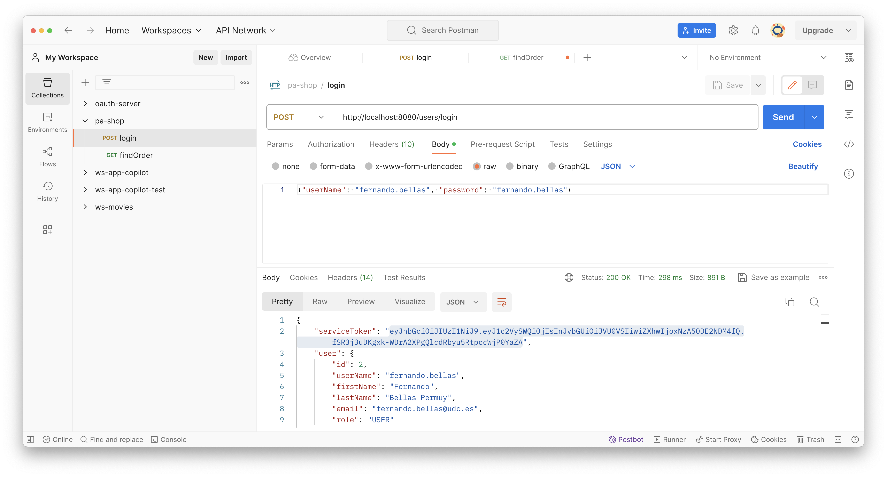
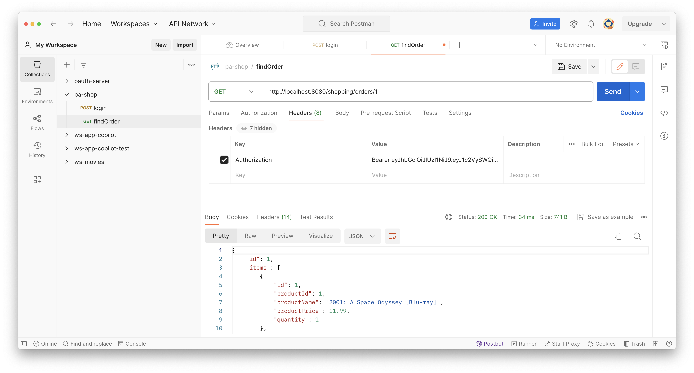

# Tareas para la semana del 10 de marzo

Para completar el backend ya sólo os queda implementar la capa de Servicios REST. Para comprobar el correcto funcionamiento del backend, debéis emplear un cliente REST (e.g. Postman).

A continuación se comentan algunos aspectos concretos a tener en cuenta.

## Cómo pasar la cabecera Authorization con Postman

Como aprendimos al final del tema 4, para las peticiones que requieran conocer la identidad del usuario, es necesario pasar la cabecera `Authorization` con el token JWT usando el esquema `Bearer`.

Tras invocar al caso de uso de autenticación, se obtiene el token:

En las peticiones que requieran el token JWT, hay que añadir la cabecera `Authorization` (pestaña "Headers"):

Por último, recordad que los tokens JWT emitidos por el backend de vuestra práctica (y de pa-shop) tienen un tiempo de vida de 1 día. Debéis actualizar el valor de la cabecera `Authorization` en las peticiones que la usen cuando sea necesario.

## Control de acceso

Recordad añadir las reglas de control de acceso propias de vuestra práctica en la clase `SecurityConfig`.

